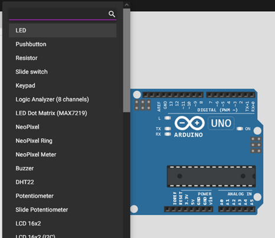

# Pertemuan ke 13 : Praktik Sensor Ultrasonic PIR LDR


## Topik Bahasan
Proyek Dasar Internet of Things I (Praktik Pemrograman Mikrokontroler, Praktik Sensor: Sensor DHT11, LCD dan Kipas, Praktik Sensor: Ultrasonic, PIR, dan LDR, Praktik Aktuator: LED dan Relay, Praktik Aktuator: Buzzer dan Servo)

## Deskripsi
- Mampu melakukan instalasi, memahami bahasa pemrograman dan pin pada Arduino. 
- Mampu melakukan uji coba serial monitor dan uji coba PWM dengan potensiometer.
- Mampu merancang dan membuat proyek menggunakan sensor DHT22.
- Mampu merancang dan membuat proyek menggunakan sensor Ultrasonic, PIR, dan LDR.
- Mampu merancang dan membuat proyek menggunakan aktuator LED dan Relay.
- Mampu merancang dan membuat proyek menggunakan aktuator Buzzer dan Servo.

## Teori Singkat

### Sensor Ultrasonic

Sensor ultrasonik adalah sebuah sensor yang berfungsi untuk mengubah besaran fisis (bunyi/gelombang ultrasonik) menjadi besaran listrik dan sebaliknya. 

Sensor ultrasonik dapat digunakan untuk mengukur jarak dengan suatu benda tertentu.

Gelombang ultrasonik adalah gelombang bunyi yang mempunyai frekuensi sangat tinggi yaitu 20.000 Hz. Bunyi ultrasonik tidak dapat di dengar oleh telinga manusia. Bunyi ultrasonik dapat didengar oleh anjing, kucing, kelelawar, dan lumba-lumba. Bunyi ultrasonik nisa merambat melalui zat padat, cair dan gas. 

  

Cara kerja sensor ini didasarkan pada prinsip dari pantulan suatu gelombang suara sehingga dapat dipakai untuk menafsirkan eksistensi (jarak) suatu benda dengan frekuensi tertentu.

 

Dengan rumus sebagai berikut:
S =  jarak (cm)
T = waktu (detik) 

 

- Sensor ultrasonik HC-SR04 menggunakan sonar untuk menentukan jarak suatu objek. 
- Sensor ini dapat membaca dari 2 cm hingga 400 cm (0,8 inci hingga 157 inci) dengan akurasi 0,3 cm (0,1 inci).
- Selain itu, modul khusus ini dilengkapi dengan modul pemancar dan penerima ultrasonik.


**Spesifikasi sensor HC-SR04**

| Nama                 | Nilai                         |
| -------------------- | ----------------------------- |
| Tegangan             | 3,3 V - 5,5 V                 |
| Arus                 | 15 mA                         |
| Frekuensi            | 40 kHz                        |
| Jangkauan minimal    | 2 cm                          |
| Jangkauan maksimal   | 4 meter                       |
| Sudut pengukuruan    | 15º                           |
| Toleransi            | 0,3 cm                        |

Pinout dari sensor ultrasonik adalah sebagai berikut


### Sensor PIR
**Sensor PIR (Passive Infra Red)** merupakan sensor yang memanfaatkan pancaran gelombang inframerah yang dipancarkan oleh benda sekitar. Dengan demikian, sensor ini dapat mengetahui adanya pergerakan yang ada di depannya.

Jangkauan sensor PIR dengan objek maksimal 12m dengan sudut sebaran 60 derajat.


**Cara kerjanya sensor PIR** yaitu pyroelectric pada sensor menerima gelombang inframerah dari benda sekitar dan menghasilkan arus listrik. Untuk memastikan yang dibaca adalah benar-benar gerakan, terdapat komparator untuk membandingkan dengan gelombang lain yang diterima. Jika terdapat perbedaan, maka output sensor akan mengeluarkan tegangan listrik.


### Sensor Cahaya
**Sensor PIR (Passive Infra Red)** Sensor cahaya atau LDR (Light Dependent Resistor) pada dasarnya adalah sebuah komponen yang memiliki resistansi yang dapat berubah ubah sesuai dengan cahaya yang diterima. Sensor ini memiliki 2 kaki yang tidak berpolaritas, sehingga pemasangan boleh terbalik.


Sensor ini akan meningkat resistansi atau hambatannya apabila cahaya yang diterima sedikit. Sebaliknya, apabila cahaya yang diterima banyak maka resistansinya akan mengecil.

Cara mengecek/mengukur sensor ini adalah dengan multimeter dan mengatur pada posisi Ohm. Saat mendapatkan cahaya terang resistansi akan berkurang disbanding dengan tidak mendapatkan cahaya. Sensor ini dapat dimanfaatkan untuk saklar lampu otomatis.


## Praktikum 1: Sensor DHT Arduino dengan Wokwi

Selesaikan langkah-langkah praktikum berikut ini menggunakan Wokwi di browser Anda.

1. Masuk ke Wokwi. Klik New Projects untuk membuat projek baru. Pilih Arduino UNO.

 

2. Tambahkan library “DHT sensor library” pada Library Manager. Pastikan library sudah muncul pada Project Libraries.

 

3. Tambahkan sensor suhu DHT22 dengan klik Add.

 
   
4. Tambahkan kode program. Pastikan DHT_PIN adalah 2

```cpp
#include "DHT.h"

#define DHTPIN 2 

#define DHTTYPE DHT22   

DHT dht(DHTPIN, DHTTYPE);

void setup() {
  Serial.begin(9600);
  Serial.println(F("DHT22 test!"));

  dht.begin();
}

void loop() {
// Wait a few seconds between measurements.
  delay(2000);

  float temperature = dht.readTemperature();
  float humidity = dht.readHumidity();

  // Check if any reads failed and exit early (to try again).
  if (isnan(temperature) || isnan(humidity)) {
    Serial.println(F("Failed to read from DHT sensor!"));
    return;
  }
  Serial.print(F("Humidity: "));
  Serial.print(humidity);
  Serial.print(F("%  Temperature: "));
  Serial.print(temperature);
  Serial.println(F("°C "));
}
```

5. Jalankan simulasi program dengan klik Run. Pastikan hasil pembacaan sensor suhu muncul di bagian bawah (serial monitor). Ubah nilai suhu dengan klik sensor DHT22, atur suhu dan kelembaban. Jika nilai pembacaan sensor pada serial monitor berubah, berarti pemrograman sensor DHT22 sudah berjalan dengan baik.
Klik Stop simulation untuk menghentikan simulasi

 


### Praktikum 2: Praktik LCD, DHT Arduino dengan Wokwi

Selesaikan langkah-langkah praktikum berikut ini menggunakan Wokwi di browser Anda.

1. Masuk ke Wokwi. Klik New Projects untuk membuat projek baru. Pilih Arduino UNO.

 

2. Tambahkan library “LiquidCrystal I2C” pada Library Manager. Pastikan library sudah muncul pada Project Libraries.


3. Tambahkan kode program seperti berikut. Pastikan SDA(A4) dan SCL(A5) sudah sesuai.


4. Jalankan simulasi program dengan klik Run. Untuk menampilkan data pada sebuah LCD diwakili dengan baris dan kolom, yang dimulai dari baris ke 0 dan kolom ke 0. Banyaknya data yang bisa ditampilkan tergantung dari spesifikasi LCD, misalkan 16x2 berarti hanya bisa menampilkan 32 digit atau karakter. Klik Stop simulation untuk menghentikan simulasi


### Praktikum 3: Praktik RTC, LCD, DHT Arduino dengan Wokwi

Selesaikan langkah-langkah praktikum berikut ini menggunakan Wokwi di browser Anda.

1. Masuk ke Wokwi. Klik New Projects untuk membuat projek baru. Pilih Arduino UNO.

 

2. Tambahkan library “DS1307RTC dan RTClib” pada Library Manager. Pastikan library sudah muncul pada Project Libraries.



3. Tambahkan kode program seperti pada gambar. Pastikan library sudah dipanggil, menambahkan kode program pada setup(), dan pada loop().


4. Rangkai sesuai pada gambar di bawah dengan komunikasi menggunakan I2C. Pastikan komunikasi I2C telah sesuai. Klik Start simulation untuk menjalankan simulasi.
   


## Praktik OLED, DHT ESP dengan Wokwi
+ Kunjungi link project ini untuk melihat implementasi DHT dan OLED di ESP32 -https://wokwi.com/projects/375444707313967105

## Praktik DHT ESP dengan Thonny
+ Skenario


  
+ Berikut code untuk membaca suhu dan kelembaban dengan sensor DHT22

```python
from machine import Pin
from time import sleep_ms
from dht import DHT22

# create dht-sensor instance
dhtSensor = DHT22(Pin(15))  

temperature = 0.0  # variable to save temperature value
humidity = 0.0     # variable to save humidity value

while True:
    dhtSensor.measure() # read sensor measurements
    temperature = dhtSensor.temperature()
    humidity = dhtSensor.humidity()

    print("T: %.1f C" %temperature)  # output temperature value
    print("H: %.1f %%" %humidity)  # output humidity value
    
    sleep_ms(2000); # pause for two seconds (2.000 milliseconds)
```

+ Hasil pembacaan sensor


  
## Tugas Mandiri 
Selesaikan langkah-langkah praktikum berikut ini menggunakan Wokwi di browser Anda.

**Tugas 1**
- Rangkai seusai dengan gambar. Tampilkan nilai suhu dan kelembaban dalam LCD. Tampilkan juga waktu dalam format YYYY/MM/DD HH:mm:ss pada LCD. Contoh: 2024/07/23 08:00:00


**Tugas 2**
- Tambahkan logika, ketika suhu < 20 maka akan tampil di LCD “DINGIN, sedangkan nilai suhu 20 - 50 “BIASA SAJA”, serta jika > 50 akan menampilkan “PANAS”.
Tampilkan juga waktu dalam format YYYY/MM/DD HH:mm:ss pada LCD. Contoh: 2024/07/23 08:00:00


